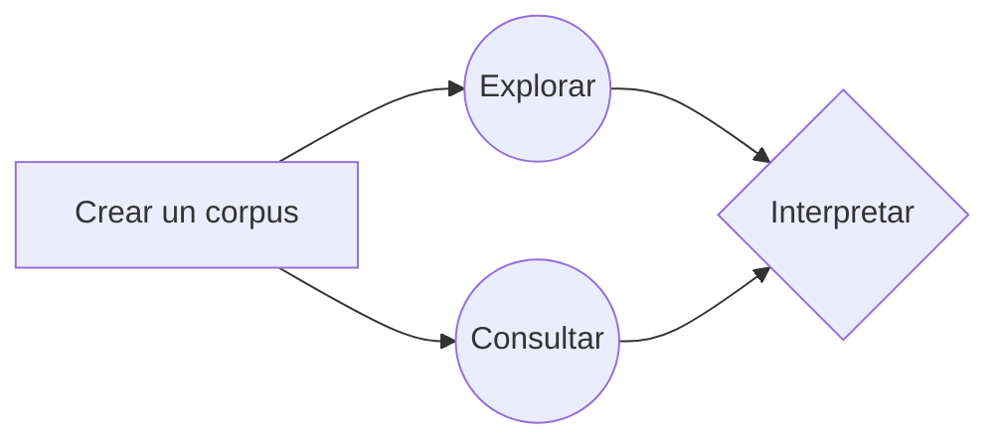
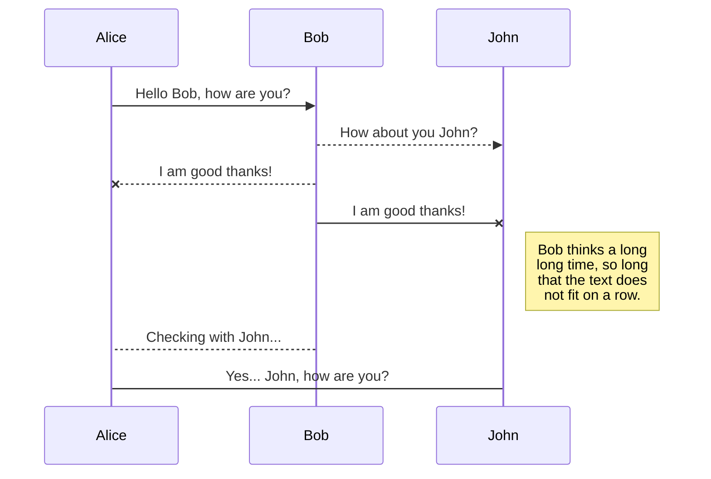

# Análisis de corpus con Voyant Tools

El análisis de corpus es un tipo de [análisis de contenido](http://vocabularios.caicyt.gov.ar/portal/index.php?task=fetchTerm&arg=26&v=42), que permite hacer comparaciones a gran escala entre los textos contenidos en dichos corpus.

Desde el inicio de la computación, lingüistas y especialistas de la [recuperación de la información](http://vocabularios.caicyt.gov.ar/portal/?task=fetchTerm&arg=178&v=42) han creado y utilizado software para apreciar patrones que no son evidentes en la lectura o bien, para corroborar hipótesis que intuían al leer ciertos textos. Por ejemplo: los patrones de uso y decaimiento de ciertos términos en una época dada, los contextos izquierdos y derechos de ciertas palabras, o las expresiones que distinguen a un grupo de textos frente a otros.

Voyant Tools (Sinclair y Rockwell, 2016) es una herramienta basada en Web y no requiere de la instalación de ningún tipo de software especializado pues funciona en cualquier equipo con conexión a internet. 

Como se ha dicho en este otro [tutorial](https://programminghistorian.org/es/lecciones/analisis-de-corpus-con-antconc), 

Al finalizar este tutorial, tendrás la capacidad de:

* Armar un corpus en texto plano
* Pensar y aplicar diferentes técnicas de segmentación de corpus
* Identificar características básicas del corpus:
	* Extensión de los documentos subidos
	* Densidad léxica (llamada densidad de vocabulario en la plataforma)
	* Promedio de palabras por oración
	* Relevancia (llamadas "palabras distintivas")
* Realizar consultas específicas sobre el corpus:
	*  Buscar palabras clave en contexto
	* Identificar patrones de uso de un término
	* Leer diferentes estadísticas sobre los vocablos (frecuencia absoluta y relativa, tendencia, curtosis, asimetría estadística)
* Exportar los datos y las visualizaciones en diferentes formatos (csv, png, html)

## Creando un corpus en texto plano

Si bien VoyantTools puede trabajar con muchos tipos de formato (HTML, XML, PDF, RTF, y MS Word); en este tutorial utilizaramos texto plano. El texto plano tienen tres ventajas fundamentales: no tiene ningún tipo de formato adicional, no requiere un programa especial y tampoco  o conocimiento extra.

### 1. Buscar textos
Lo primero que debes hacer es buscar la información que te interesa. Para este tutorial, [Riva Quiroga](https://twitter.com/rivaquiroga) y yo preparamos un corpus de los discursos anuales de presidentes de Argentina, Chile, Colombia, México y Perú (¡gracias [Pamela Sertzen](https://twitter.com/madvivacious)!) entre 2016 y 2010, es decir dos años antes de la crisis económica de 201. 

### 2. Copiar en editor de texto plano
Una vez localizada la información, el segundo paso es copiar el texto que te interesa desde la primera palabra dicha hasta la última y guardarla en un editor de texto sin formato. Por ejemplo:
* en Windows podría guardarse en Bloc de Notas

* en Mac, en TextEdit; 

* y en Linux, en Gedit.

### 3. Guardar archivo

Cuando guardes el texto debes considerar tres cosas esenciales:

La primera es que, si los textos de tu corpus están en español, deberás **guardarlos en UTF-8**, que es un formato de codificación de caracteres estándar para este idioma. 

(gif de cómo guardar)

> **¿Qué es utf-8?** Si bien en nuestra pantalla vemos que al teclear una "É" aprece una "É"; para una computadora "É" es una serie de ceros y unos que son interpretados en imagen depiendo del "traductor" o "codificador" que se esté usando. El codificador que contiene códigos binarios para todas los caracteres que se usan en el español es UTF-8. Siguiendo con el ejemplo "11000011", es una cadena de ocho bits --es decir, **ocho** espacios de información-- que en UTF-**8** son interpretados como "É"

La segunda es que **el nombre de tu archivo no debe contener acentos ni espacios**, esto asegurará que pueda ser abierto en otros sistemas operativos

> **¿Por qué evitar acentos y espacios en los nombres de archivo?** Por razones similares a el inciso anterior, un archivo que se llame Ébano.txt no siempre será entendido de forma correcta por todos los sistemas operativos pues varios tienen otro codificador por defecto. Muchos usan ASCII, por ejemplo, que sólo tiene siete bits de manera que el último bit (1) de "11000011" es interpretado como el inicio del siguiente caracter y se descuadra la interpretación.

La tercera es que es una buena práctica integrar ciertos metadatos de contexto (v.g. fecha, género, autor, origen) en el nombre del archivo que te permitan partir tu corpus según diferentes criterios y también leer mejor los resultados. Para este tutorial hemos nombrado los archivos con el año del discurso presidencial, el 
código del país ([ISO 3166-1 alfa-2](https://www.iso.org/obp/ui/#search)) y el apellido de quien profirió el disurso. 

> [2007_mx_calderon.txt](https://github.com/corpusenespanol/discursos-presidenciales/blob/master/mexico/2007_mx_calderon.txt "2007_mx_calderon.txt") tiene el año del discurso dividido con un guión bajo, el código de dos letras del país (México = mx) y el apellido del presidente que dictó el discurso, Calderón, (sin acentos ni eñes) 

## Cargar el corpus

En la página de entrada de Voyant Tools encontrarás cuatro opciones sencillas para cargar textos.1 Las dos primeras opciones son en el cuadro blanco. En este cuadro puedes pegar directamente un texto que hayas copiado de algún lugar; o bien, pegar la(s) dirección(es) web --separadas por comas-- de los sitios en donde se encuentren los textos que quieres analizar. 
Una tercera opción es "Abrir" alguno de los dos corpus que Voyant tiene precargados (las obras de Shakespeare o las novelas de Austen: ambos en inglés).

Por último, está la opción que usaremos en este tutorial, en la que puedes cargar directamente los documentos que tengas en tu computadora. En este caso subiremos el [corpus completo](https://github.com/corpusenespanol/discursos-presidenciales/tree/master/corpus-completo) de discursos presidenciales. 

>  **Para obtener los materiales** de este tutorial ve [a esta página de Github](https://github.com/corpusenespanol/discursos-presidenciales/tree/master/corpus-completo)  y descarga todos los archivos:

>  **Para descomprimir en Windows** haz clic derecho en el  archivo comprimido (.**ZIP**). En el menú desplegable, selecciona **7-zip**  y haz clic en "Extraer aquí"
>    **Para descomprimir en Mac** da doble clic sobre el archivo comprimido
>    **Para descomprimir en Linux** botón derecho + "Extraer aquí"

Para cargar los materiales pulsas sobre el icono que dice cargar, abres tu explorador de archivos y, dejando presionada la tecla 'Shift' seleccionas todos los archivos que vas a usar. Para esta primera parte del tutorial subiremos todos los archivos de la carpeta ["corpus completo"](https://github.com/corpusenespanol/discursos-presidenciales/tree/master/corpus-completo)

## Explorando el corpus

Una vez cargados todos los archivos llegará a la 'interfaz' ('skin') que tiene las cinco herramientas por defecto:
1. Cirrus: un tipo de nube de palabras que muestra los términos más frecuentes
2. Lector: un lector de corpus eficiente que busca segmentos de texto a medida que se desplaza
Tendencias: un gráfico de distribución que muestra los términos en todo el corpus (o términos dentro de un documento)
Resumen: una herramienta que proporciona una visión general textual simple del corpus actual
Contextos: una concordancia que muestra cada ocurrencia de una palabra clave con un poco de contexto circundante
2.  Filtrar palabras comunes (o stopwords)
Dar clic en el “switch”, esquina superior derecha cuanda pasas mouse

Dar clic en editar lista

Agregar palabras “ruido”, siempre separadas con “enter”

  

3. Ver palabras en contexto

En la barra libre inferior esquina izquierda, escribir palabra que se desea analizar

Para exportar los datos (la opción te da un txt separado por tabulación) se da clic en el cuadro con flecha y luego en la opción “exportar datos actuales” y se selecciona la última opción

  

Normalmente copy paste funciona. Si no lo hace guardar en txt y luego abrir excel y dar clic en datos y después “Desde un archivo de texto”

 

4. Crear árbol de palabras

En el icono que parece “ventana windows” dar clic

5. Obtener estadísticas comparadas de los documentos (densidad, palabras diferenciadas, etc)

  

**HTML**

El Lenguaje para el Marcado de Documentos de Hipertexto (HyperText Markup Language_) es un lenguaje estandarizado para dar formato a documentos que sirvan para crear páginas web y aplicaciones web

## Bibliografía

Sinclair, Stéfan and Geoffrey Rockwell, 2016.  _Voyant Tools_. Web. [http://voyant-tools.org/](http://voyant-tools.org/).

# Publication

Publishing in StackEdit makes it simple for you to publish online your files. Once you're happy with a file, you can publish it to different hosting platforms like **Blogger**, **Dropbox**, **Gist**, **GitHub**, **Google Drive**, **WordPress** and **Zendesk**. With [Handlebars templates](http://handlebarsjs.com/), you have full control over what you export.

> Before starting to publish, you must link an account in the **Publish** sub-menu.

## Publish a File

You can publish your file by opening the **Publish** sub-menu and by clicking **Publish to**. For some locations, you can choose between the following formats:

- Markdown: publish the Markdown text on a website that can interpret it (**GitHub** for instance),
- HTML: publish the file converted to HTML via a Handlebars template (on a blog for example).

## Update a publication

After publishing, StackEdit keeps your file linked to that publication which makes it easy for you to re-publish it. Once you have modified your file and you want to update your publication, click on the **Publish now** button in the navigation bar.

> **Note:** The **Publish now** button is disabled if your file has not been published yet.

## Manage file publication

Since one file can be published to multiple locations, you can list and manage publish locations by clicking **File publication** in the **Publish** sub-menu. This allows you to list and remove publication locations that are linked to your file.

# Markdown extensions

StackEdit extends the standard Markdown syntax by adding extra **Markdown extensions**, providing you with some nice features.

> **ProTip:** You can disable any **Markdown extension** in the **File properties** dialog.

## SmartyPants

SmartyPants converts ASCII punctuation characters into "smart" typographic punctuation HTML entities. For example:

|                |ASCII                          |HTML                         |
|----------------|-------------------------------|-----------------------------|
|Single backticks|`'Isn't this fun?'`            |'Isn't this fun?'            |
|Quotes          |`"Isn't this fun?"`            |"Isn't this fun?"            |
|Dashes          |`-- is en-dash, --- is em-dash`|-- is en-dash, --- is em-dash|

## KaTeX

You can render LaTeX mathematical expressions using [KaTeX](https://khan.github.io/KaTeX/):

The *Gamma function* satisfying $\Gamma(n) = (n-1)!\quad\forall n\in\mathbb N$ is via the Euler integral

$$
\Gamma(z) = \int_0^\infty t^{z-1}e^{-t}dt\,.
$$

> You can find more information about **LaTeX** mathematical expressions [here](http://meta.math.stackexchange.com/questions/5020/mathjax-basic-tutorial-and-quick-reference).

## UML diagrams

You can render UML diagrams using [Mermaid](https://mermaidjs.github.io/). For example, this will produce a sequence diagram:

And this will produce a flow chart:

## Notas al pie

1 Existen formas más complejas para cargar corpus que [puedes consultar en la documentación en inglés](https://voyant-tools.org/docs/#!/guide/corpuscreator)
<!--stackedit_data:
eyJoaXN0b3J5IjpbMTA1MjI3NjQ0MiwtNDc3NTQ0OTMyLC03OD
gwMTk5MzMsNDMwMTgzMzQ4LDkyNjA4MDYxMSwtNjAzODQyMzc5
LC0xODM1MzQzNTUzLDE3MTM2MTQyODgsLTExMDA2MjM5NzMsMz
MyMTcxODI0LC0yMDc3NzQxOTc1LC0xMjEyODE3MzQyXX0=
-->